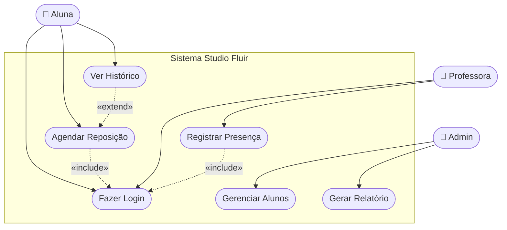
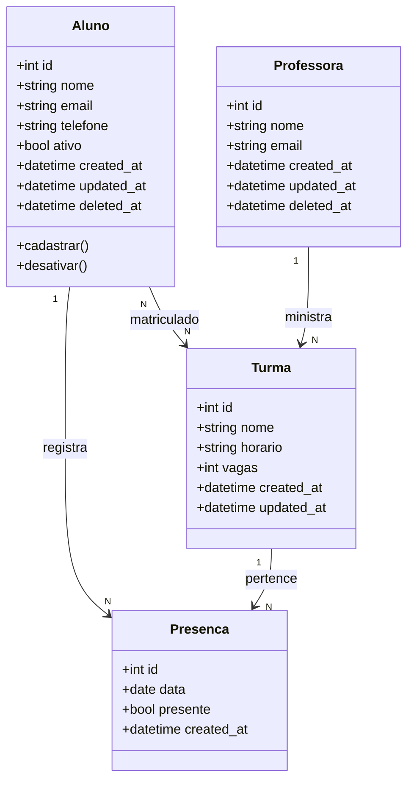
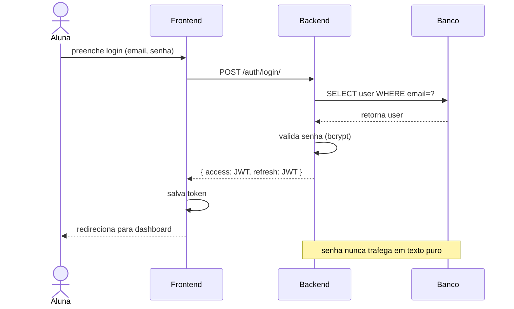
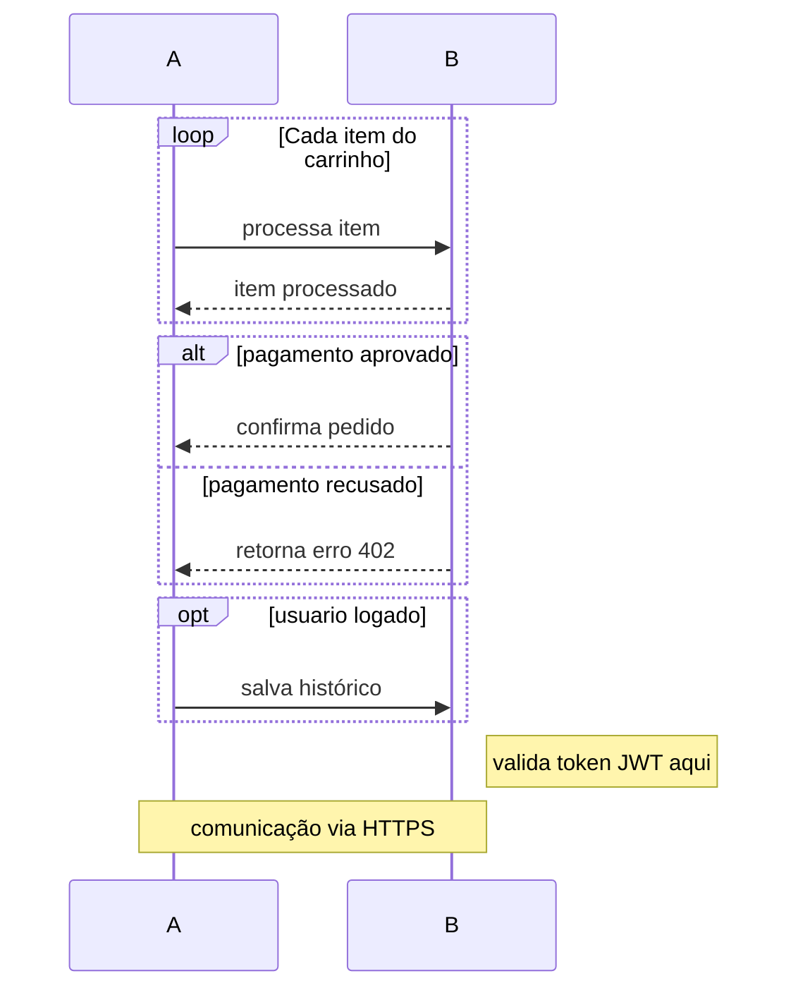
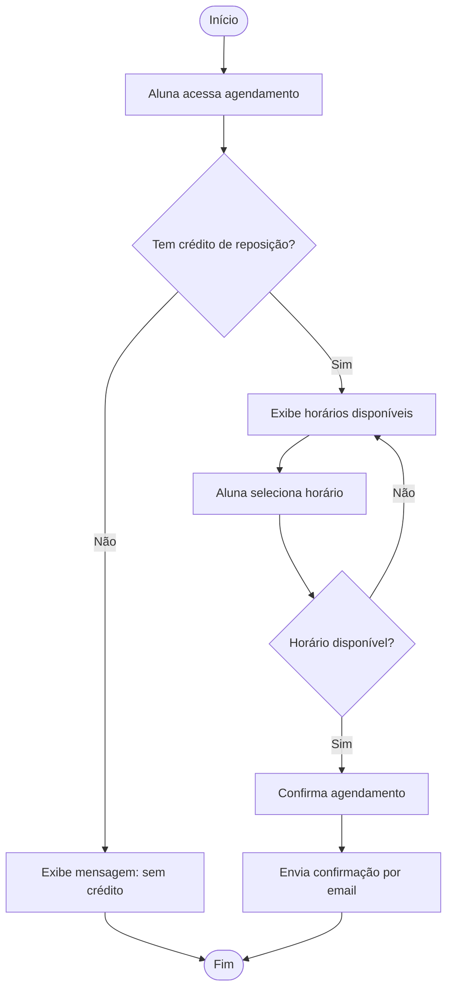
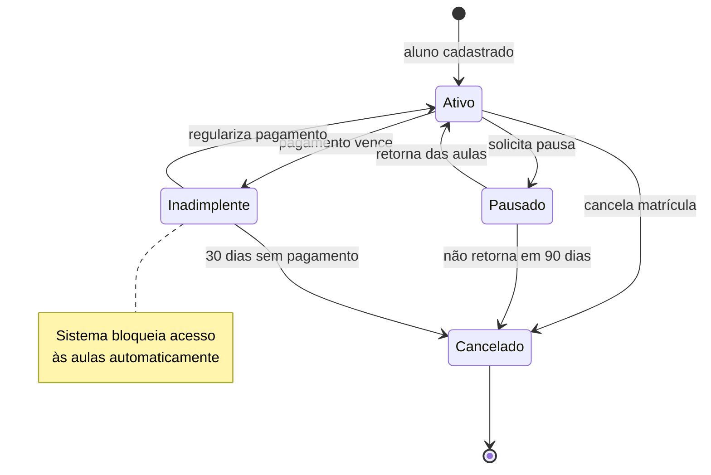
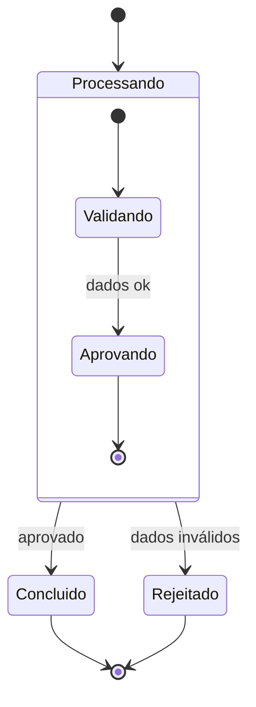
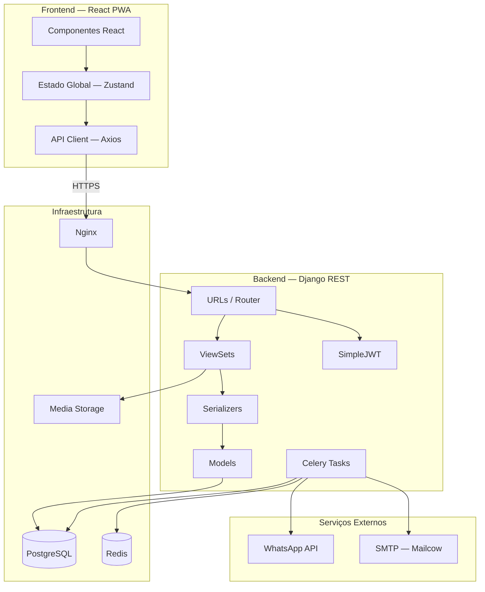
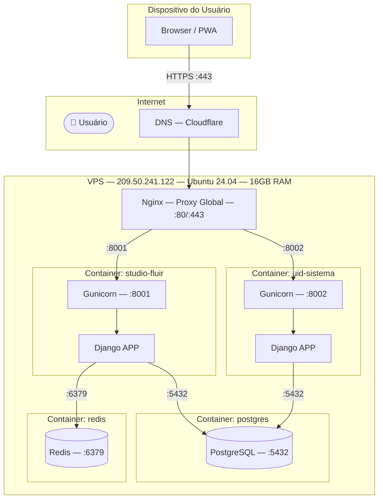

# AnalistaUML — Diagramas UML em Mermaid

---

## Por que esta skill existe

O Claude Code alucina sintaxe Mermaid. Cada diagrama UML tem regras
específicas de notação — setas diferentes, palavras-chave reservadas,
elementos obrigatórios. Sem referência exata, o diagrama gera erro
ou renderiza errado silenciosamente.

Esta skill é a referência canônica. **Consulte antes de gerar qualquer diagrama.**

---

## Os 7 Diagramas — Mapa Rápido

```
Diagrama          Responde             Quem usa
──────────────    ─────────────────    ──────────────
Casos de Uso      Quem faz o quê?      Analista + Cliente
Classes           Como os dados se     Blueprint + Forge
                  relacionam?
Sequência         Quem chama quem?     Forge + Blueprint
Atividade         Como o processo      Analista + Cliente
                  flui?
Estado            Como o objeto        Forge
                  muda ao longo
                  do tempo?
Componentes       Como o software      Blueprint + Pilot
                  está organizado?
Implantação       Onde o software      Pilot + DevOps
                  roda?
```

---

## 1. Diagrama de Casos de Uso

### O que é

Mostra **quem** interage com o sistema e **o que** cada um pode fazer.
Não mostra como — só o quê. É o mais próximo da linguagem do cliente.

```
Atores    → quem usa o sistema (pessoa, sistema externo)
Use Cases → o que o sistema oferece (elipses)
Sistema   → caixa que delimita o escopo
```

### Quando usar

- Primeiro diagrama de qualquer projeto
- Mostrar escopo pro cliente
- Definir quem faz o quê antes de modelar classes

### Sintaxe Mermaid



### Regras obrigatórias

```
✅ Ator SEMPRE fora do subgraph — nunca dentro do sistema
✅ Use Case começa com VERBO — "Cadastrar", "Gerar", "Visualizar"
✅ «include» = sempre executa junto (obrigatório)
✅ «extend» = executa só em condição específica (opcional)
✅ Herança de ator: Admin --|> Usuario (herda tudo que Usuario faz)
✅ Ator humano com ([👤 Nome]) — parênteses duplos
```

### Armadilhas

```
❌ Use Case como substantivo — "Login" errado, "Fazer Login" certo
❌ Ator dentro do subgraph
❌ Confundir include com extend:
   include = "Agendar Reposição" SEMPRE inclui "Verificar Crédito"
   extend  = "Registrar Presença" PODE estender "Enviar Alerta de Falta"
❌ Colocar fluxo interno — isso é Sequência, não Caso de Uso
❌ Mais de 10 use cases num diagrama — dividir por módulo
```

---

## 2. Diagrama de Classes

### O que é

Mostra a **estrutura estática** do sistema — entidades, atributos,
métodos e relacionamentos. É a planta baixa do banco e do código.

### Quando usar

- Após identificar as entidades na Análise
- Antes de criar os models no Django
- Para documentar relacionamentos e cardinalidades

### Sintaxe Mermaid



### Tipos de relacionamento

```
Associação    -->    A usa B
                     Aluno --> Presenca

Agregação     o-->   "tem um", parte existe sem o todo
                     Turma o--> Aluno

Composição    *-->   "composto de", parte NÃO existe sem o todo
                     Pedido *--> ItemPedido

Herança       --|>   A é um tipo de B
                     Admin --|> Usuario

Dependência   ..>    A usa B temporariamente
                     Relatorio ..> Aluno

Realização    ..|>   A implementa interface B
                     EmailService ..|> Notificavel
```

### Cardinalidade

```
"1"    → exatamente um
"0..1" → zero ou um (opcional)
"N"    → muitos
"1..N" → um ou muitos
"0..N" → zero ou muitos
```

### Regras obrigatórias

```
✅ Sempre incluir created_at e updated_at em todas as entidades
✅ Sempre incluir deleted_at (soft delete — padrão Uid)
✅ Valores monetários como Decimal — NUNCA Float
✅ Cardinalidade em TODOS os relacionamentos
✅ Atributos com tipo explícito
✅ Visibilidade: + público, - privado, # protegido
```

### Armadilhas

```
❌ Confundir agregação com composição:
   Composição: ItemPedido sem Pedido não existe
   Agregação:  Aluno sem Turma ainda é um Aluno

❌ FK como atributo E relacionamento ao mesmo tempo
   Escolhe um — o relacionamento já implica a FK

❌ N:N sem classe associativa
   Aluno N:N Turma precisa de Matricula no meio
   com seus próprios atributos (data_matricula, status)

❌ Herança quando deveria ser composição
   Só herda quando é "é um tipo de" — não pra reaproveitar código

❌ Classe sem atributos — se não tem dado, é use case, não entidade
```

---

## 3. Diagrama de Sequência

### O que é

Mostra a **comunicação entre objetos ao longo do tempo** — quem chama
quem, em que ordem, com que dados. É o diagrama mais próximo do código
em execução.

### Quando usar

- Fluxo com múltiplos componentes interagindo
- Autenticação, pagamento, integrações
- Quando dev precisa entender o fluxo antes de implementar

### Sintaxe Mermaid



### Elementos especiais



### Tipos de seta

```
->>   síncrona (chamada)         A->>B: chama método
-->>  retorno (resposta)         B-->>A: retorna dado
-)    assíncrona                 A-)B: dispara e esquece
-x    falha                      A-xB: erro na chamada
```

### Regras obrigatórias

```
✅ actor para usuário humano, participant para sistemas
✅ Retornos SEMPRE com seta tracejada -->>
✅ Nomear mensagens com dado real — não "envia dados"
✅ Incluir token JWT nos fluxos autenticados
✅ Separar fluxo feliz do erro com alt/else
✅ Note para informações importantes fora do fluxo
```

### Armadilhas

```
❌ Detalhar demais — não é pseudocódigo
   Mostra o fluxo, não cada linha de código

❌ Esquecer retornos — toda chamada tem resposta
   mesmo que seja só "200 OK" ou "204 No Content"

❌ Banco como actor — banco é participant, nunca actor

❌ Misturar níveis — não mistura HTTP com método interno
   no mesmo diagrama

❌ Fluxo sem tratamento de erro — sempre incluir alt com erro
```

---

## 4. Diagrama de Atividade

### O que é

Mostra o **fluxo de um processo** — decisões, caminhos, início e fim.
É o fluxograma do UML. O cliente consegue seguir, o dev consegue
implementar.

### Quando usar

- Mapear processos de negócio com decisões
- Fluxo de agendamento, cobrança, onboarding
- Qualquer coisa com "se isso, então aquilo"

### Sintaxe Mermaid



### Elementos

```
([Texto])    → Início e Fim — sempre círculo arredondado
[Texto]      → Ação — retângulo
{Texto?}     → Decisão — losango — sempre com pergunta
[[Texto]]    → Subprocesso — retângulo com bordas duplas
/Texto/      → Entrada/Saída manual
```

### Regras obrigatórias

```
✅ Sempre começar com ([Início]) e terminar com ([Fim])
✅ Decisão sempre com pergunta no losango — "Tem crédito?"
✅ Rótulos em TODAS as setas de decisão — |Sim| e |Não|
✅ Todo caminho precisa chegar ao Fim — sem setas soltas
✅ Ações com verbo no infinitivo — "Registrar", não "Registro"
✅ TD por padrão — LR só se o fluxo for muito largo
```

### Armadilhas

```
❌ Losango sem rótulo nas saídas — sempre nomear as condições
❌ Caminho sem fim — toda ramificação precisa convergir ou terminar
❌ Fluxo muito longo — dividir em subprocessos
❌ Confundir com Sequência:
   Atividade = O QUÊ acontece no processo
   Sequência = QUEM faz pra QUEM no sistema
❌ Decisão com mais de 2 saídas sem nomear todas
```

---

## 5. Diagrama de Estado

### O que é

Mostra os **estados possíveis de um objeto** e as **transições** entre eles
— o que dispara a mudança de um estado pro outro.

### Quando usar

- Ciclo de vida de entidades: aluno ativo/pausado/cancelado
- Pedido aberto/aprovado/entregue/cancelado
- Cobrança pendente/paga/vencida
- Quando você tem `if status == 'x'` espalhado pelo código

### Sintaxe Mermaid



### Estados compostos



### Regras obrigatórias

```
✅ [*] é o estado inicial E o estado final
✅ Toda transição tem um gatilho nomeado
✅ Todo estado tem pelo menos uma entrada e uma saída
   (exceto o estado final)
✅ Estados como substantivo — "Ativo", não "Está ativo"
✅ Condição entre colchetes — [saldo > 0]
✅ Usar stateDiagram-v2 — não stateDiagram (versão antiga)
```

### Armadilhas

```
❌ Estado sem saída (exceto [*]) — objeto preso para sempre
❌ Transição sem gatilho — o que dispara a mudança?
❌ Confundir com Atividade:
   Estado = ciclo de vida de UM objeto
   Atividade = fluxo de um processo completo

❌ Mais de 8 estados sem usar estados compostos
❌ Esquecer estados de erro — "Cancelado", "Rejeitado",
   "Expirado" são estados válidos e importantes
```

---

## 6. Diagrama de Componentes

### O que é

Mostra a **arquitetura física do software** — módulos, serviços,
bibliotecas e como se conectam. Mostra o sistema por dentro —
não o que ele faz, mas como está organizado.

### Quando usar

- Documentar arquitetura da aplicação
- Mostrar separação de responsabilidades
- Dependências entre módulos e serviços
- Interfaces entre times diferentes

### Sintaxe Mermaid



### Regras obrigatórias

```
✅ Agrupar por contexto — Frontend, Backend, Infra, Externo
✅ Nomear conexões com protocolo — HTTPS, SQL, AMQP, gRPC
✅ Separar interno de externo ao sistema
✅ Banco e cache como componentes de infraestrutura
✅ Serviços externos em subgraph separado
```

### Armadilhas

```
❌ Detalhar atributos e métodos — isso é diagrama de Classes
   Componentes mostra módulos, não internals

❌ Confundir com Implantação:
   Componentes = O SOFTWARE e sua organização
   Implantação = ONDE o software roda fisicamente

❌ Setas sem direção definida — dependência tem direção
   A depende de B: A --> B

❌ Misturar granularidade — não coloca "React" e
   "botão de login" no mesmo nível

❌ Esquecer serviços externos — fazem parte do sistema
```

---

## 7. Diagrama de Implantação

### O que é

Mostra **onde o software roda** — servidores, containers, dispositivos,
redes. É o mapa físico da infraestrutura. O mais próximo do
docker-compose e do nginx.conf.

### Quando usar

- Documentar infraestrutura de produção
- Planejar novo deploy
- Mostrar pro cliente onde o sistema dele está rodando
- Onboarding de novo DevOps

### Sintaxe Mermaid



### Regras obrigatórias

```
✅ Mostrar portas em TODAS as conexões — :8001, :5432, :443
✅ Separar por ambiente — produção, staging, local
✅ Protocolo nas setas — HTTP, HTTPS, TCP, SSH
✅ Containers como subgraph dentro do servidor
✅ Dispositivos do usuário como nós externos
✅ Serviços externos separados — CDN, DNS, API de pagamento
✅ Especificar SO e recursos no nó do servidor
```

### Armadilhas

```
❌ Confundir com Componentes:
   Implantação = ONDE roda (servidor, container, porta)
   Componentes = O QUE roda (módulo, serviço, biblioteca)

❌ Esquecer Nginx / load balancer — é ele que recebe tudo

❌ Não mostrar portas — porta é informação crítica pro DevOps

❌ Misturar ambiente de dev com produção no mesmo diagrama

❌ Esquecer Certbot / SSL — faz parte da implantação

❌ Container sem porta mapeada — sempre especificar
```

---

## Referência Rápida — Qual diagrama usar?

| Pergunta | Diagrama |
|---|---|
| Quem usa o sistema e o quê? | Casos de Uso |
| Como os dados se relacionam? | Classes |
| Quem chama quem e em que ordem? | Sequência |
| Como o processo flui com decisões? | Atividade |
| Quais estados um objeto pode ter? | Estado |
| Como o software está organizado? | Componentes |
| Onde o software roda? | Implantação |

---

## Ordem de geração por fase do projeto

```
Elicitação / Análise
└── Casos de Uso — define escopo com o cliente

Especificação
├── Atividade   — mapeia os fluxos principais
├── Classes     — modela as entidades
└── Estado      — define ciclo de vida das entidades

Arquitetura
├── Sequência   — define comunicação entre camadas
└── Componentes — define organização do software

Deploy
└── Implantação — documenta onde tudo roda
```

---

> Esta skill é companheira da AnalistaSKILL.md.
> Analista usa Casos de Uso, Atividade e Estado.
> Blueprint usa Classes, Sequência e Componentes.
> Pilot usa Implantação.
> Todos os diagramas gerados em Mermaid — versionáveis no Git.
